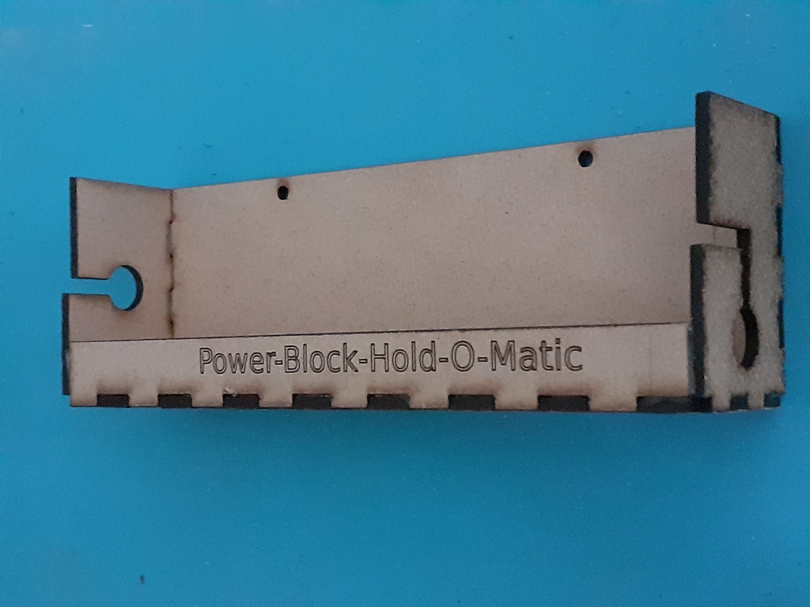
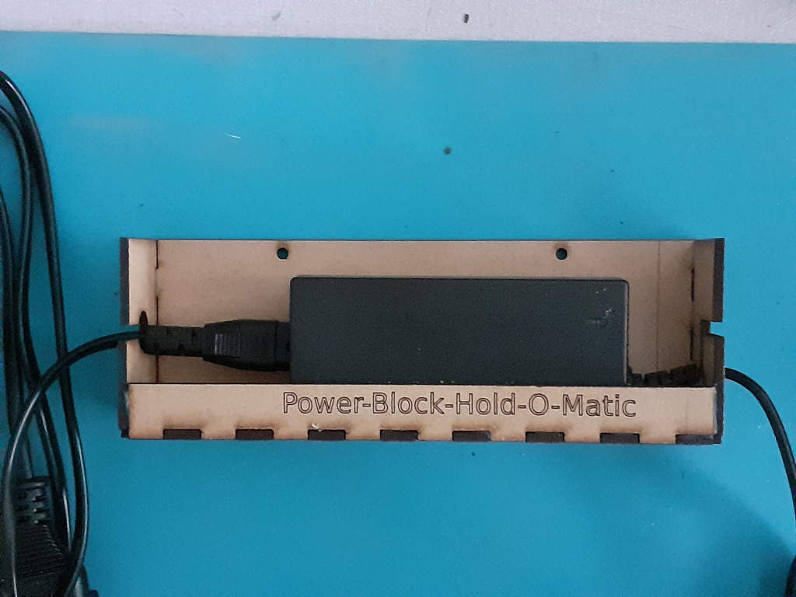
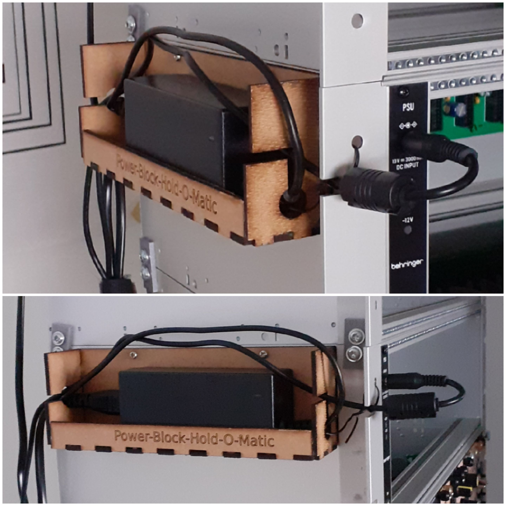

# Power-Block-Hold-O-Matic

This repo contains design files for a power adapter holder that can be used to hang a Behringer CP1A power supply adapter from the side of a 10-inch rack case.
Since I have several of these power supplies in my rack this makes for a much tidier look compared to having the power supply adapters lying all over the place.

The design was made using openscad and the exported .svg files were used to cut the parts from hard board (which I think is a mixture of compressed wood particles and glue) using a K40 laser. Of course you can plywood as well or 3D-print the parts.

